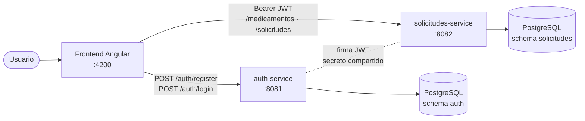
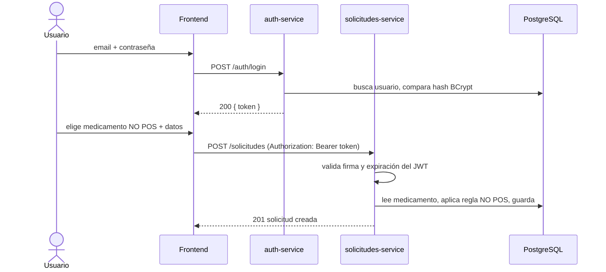
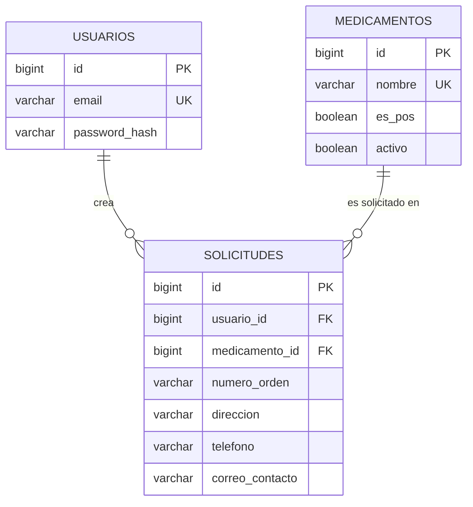

# Solicitudes de Medicamentos

Aplicación full stack basada en servicios para gestionar solicitudes de medicamentos. Dos APIs REST independientes (autenticación y solicitudes), un frontend Angular y PostgreSQL. Los medicamentos **NO POS** exigen datos adicionales (número de orden, dirección, teléfono y correo).

| Capa | Tecnología |
|---|---|
| Auth API | Java 21 · Spring Boot 3.5 · Spring Security · JWT (HS256) · BCrypt |
| Solicitudes API | Java 21 · Spring Boot 3.5 · Spring Data JPA · Spring Security (resource server) |
| Frontend | Angular 19 (standalone, signals, formularios reactivos, lazy loading) |
| Base de datos | PostgreSQL 16 |
| Infraestructura | Docker Compose · GitHub Actions |

## Contenido
1. [Inicio rápido](#inicio-rápido)
2. [Arquitectura](#arquitectura)
3. [Estructura del repositorio](#estructura-del-repositorio)
4. [Instalación manual (sin Docker)](#instalación-manual-sin-docker)
5. [Variables de entorno](#variables-de-entorno)
6. [Endpoints](#endpoints)
7. [Base de datos](#base-de-datos)
8. [Decisiones de diseño y supuestos](#decisiones-de-diseño-y-supuestos)
9. [Seguridad](#seguridad)
10. [Pruebas](#pruebas)
11. [Mejoras futuras](#mejoras-futuras)

## Inicio rápido

Requisitos: **Docker** y **Docker Compose v2**.

```bash
cp .env.example .env
# Edita .env: define POSTGRES_PASSWORD y JWT_SECRET (mínimo 32 caracteres).
#   Generar un secreto:  openssl rand -base64 48

docker compose up --build
```

La primera vez se compilan las imágenes (unos minutos). Cuando termine:

| Servicio | URL |
|---|---|
| Aplicación web | http://localhost:4200 |
| Auth API (Swagger) | http://localhost:8081/swagger-ui.html |
| Solicitudes API (Swagger) | http://localhost:8082/swagger-ui.html |
| PostgreSQL | `localhost:5432` |

1. Abre http://localhost:4200 y pulsa **Regístrate**.
2. Inicia sesión.
3. Crea una solicitud: con un medicamento **POS** basta elegirlo; con uno **NO POS** (marcado en la lista) aparece el bloque de datos adicionales.
4. Consulta **Mis solicitudes** (paginado).

Para reiniciar la base de datos desde cero: `docker compose down -v`.

**Prueba de humo automática** (con el stack levantado): `./scripts/smoke-test.sh` recorre registro, login, creación POS/NO POS, validaciones, paginación y aislamiento entre usuarios (22 verificaciones).

## Arquitectura



Los servicios **no se llaman entre sí**: `auth-service` firma el JWT y `solicitudes-service` lo valida de forma *stateless* con el mismo secreto, por lo que pueden desplegarse y escalar por separado.



### Capas de cada servicio
`controller` (HTTP y OpenAPI) → `service` (reglas de negocio, transacciones) → `repository` (Spring Data). Los `dto` (records inmutables) están separados de las `entity`. `exception` centraliza el manejo de errores y `config` la seguridad. La regla NO POS vive aislada en `SolicitudNoPosValidator`, por lo que se prueba sin HTTP ni BD.

## Estructura del repositorio

```
├── auth-service/            API de autenticación (Maven)
├── solicitudes-service/     API de solicitudes (Maven)
├── frontend/                Angular
│   └── src/app/
│       ├── core/            AuthService, interceptor, guards, modelos, utilidades (singleton de la app)
│       ├── shared/          componentes y validadores reutilizables (paginador, errores de campo, alertas)
│       ├── layout/          cabecera
│       └── features/        auth/ (login, registro) · solicitudes/ (formulario, listado, servicios)
├── database/                schema.sql · seed.sql · er-diagram.md (modelo E-R en Mermaid)
├── docs/                    postman-collection.json
├── scripts/smoke-test.sh    prueba de humo end-to-end
├── .github/workflows/ci.yml integración continua
├── docker-compose.yml
└── .env.example
```

## Instalación manual (sin Docker)

Requisitos: **JDK 21**, **Maven 3.9+**, **Node 20+**, **PostgreSQL 16**.

**1. Base de datos**
```bash
createdb -U postgres medicamentos
psql -U postgres -d medicamentos -f database/schema.sql
psql -U postgres -d medicamentos -f database/seed.sql
```

**2. Backends** (cada uno en su terminal; ambos con el **mismo** `JWT_SECRET`)
```bash
export DB_URL=jdbc:postgresql://localhost:5432/medicamentos DB_USER=postgres DB_PASSWORD=<tu_password>
export JWT_SECRET=$(openssl rand -base64 48)      # cópialo al segundo servicio

cd auth-service        && mvn spring-boot:run     # http://localhost:8081
cd solicitudes-service && mvn spring-boot:run     # http://localhost:8082
```

**3. Frontend**
```bash
cd frontend
npm ci
npm start                                         # http://localhost:4200
```
Las URLs de las APIs se configuran en `frontend/src/environments/environment.ts`.

## Variables de entorno

| Variable | Servicio | Descripción | Por defecto |
|---|---|---|---|
| `DB_URL` | ambos | URL JDBC | `jdbc:postgresql://localhost:5432/medicamentos` |
| `DB_USER` / `DB_PASSWORD` | ambos | Credenciales de BD | `app` / `app` |
| `JWT_SECRET` | ambos | Secreto de firma HS256, **≥ 32 caracteres**, idéntico en ambos | *(obligatorio; la app no arranca sin él)* |
| `JWT_EXPIRATION_MINUTES` | auth | Vigencia del token | `60` |
| `CORS_ALLOWED_ORIGINS` | ambos | Origen(es) permitidos del frontend | `http://localhost:4200` |

Con Docker Compose se definen en `.env` (`POSTGRES_DB`, `POSTGRES_USER`, `POSTGRES_PASSWORD` incluidas). El archivo `.env` está en `.gitignore`.

## Endpoints

Documentación interactiva en Swagger UI (ver [Inicio rápido](#inicio-rápido)) y colección en [`docs/postman-collection.json`](docs/postman-collection.json).

### auth-service (`:8081`)

| Método | Ruta | Auth | Descripción | Respuestas |
|---|---|---|---|---|
| `POST` | `/auth/register` | No | Registra un usuario | `201` · `400` datos inválidos · `409` correo ya registrado |
| `POST` | `/auth/login` | No | Devuelve un JWT | `200` · `400` · `401` credenciales inválidas |

```bash
curl -X POST localhost:8081/auth/register -H 'Content-Type: application/json' \
  -d '{"nombre":"Ana Pérez","email":"ana@correo.com","password":"Clave12345"}'
# 201 {"id":1,"nombre":"Ana Pérez","email":"ana@correo.com"}

curl -X POST localhost:8081/auth/login -H 'Content-Type: application/json' \
  -d '{"email":"ana@correo.com","password":"Clave12345"}'
# 200 {"token":"eyJhbGciOi...","tipo":"Bearer","expiraEn":3600}
```

### solicitudes-service (`:8082`) — requiere `Authorization: Bearer <token>`

| Método | Ruta | Descripción | Respuestas |
|---|---|---|---|
| `GET` | `/medicamentos` | Catálogo de medicamentos activos (`esPos` indica POS / NO POS) | `200` · `401` |
| `POST` | `/solicitudes` | Crea una solicitud | `201` · `400` · `401` · `422` |
| `GET` | `/solicitudes?page=0&size=10` | Solicitudes **del usuario autenticado**, más recientes primero | `200` · `400` · `401` |

**Crear solicitud.** POS: solo `medicamentoId`. NO POS: los cuatro campos son obligatorios.
```bash
TOKEN=<token del login>

# Medicamento POS
curl -X POST localhost:8082/solicitudes -H "Authorization: Bearer $TOKEN" \
  -H 'Content-Type: application/json' -d '{"medicamentoId":1}'

# Medicamento NO POS
curl -X POST localhost:8082/solicitudes -H "Authorization: Bearer $TOKEN" \
  -H 'Content-Type: application/json' \
  -d '{"medicamentoId":6,"numeroOrden":"ORD-2026-001","direccion":"Calle 10 # 20-30, Bogotá",
       "telefono":"3001234567","correoContacto":"ana@correo.com"}'
```

**Listado paginado** (`page` base 0, `size` entre 1 y 50, por defecto 10):
```json
{
  "content": [
    { "id": 4, "medicamento": { "id": 6, "nombre": "Adalimumab 40 mg jeringa prellenada", "esPos": false },
      "numeroOrden": "ORD-2026-001", "direccion": "Calle 10 # 20-30, Bogotá",
      "telefono": "3001234567", "correoContacto": "ana@correo.com", "createdAt": "2026-09-24T19:40:12Z" }
  ],
  "page": 0, "size": 10, "totalElements": 4, "totalPages": 1
}
```

### Formato de errores (RFC 7807)
Todos los errores, incluidos los 401 que genera el filtro de seguridad, usan `application/problem+json`:
```json
{
  "type": "about:blank",
  "title": "Error de validación",
  "status": 400,
  "detail": "La solicitud contiene datos inválidos",
  "errors": {
    "numeroOrden": "El número de orden es obligatorio para medicamentos NO POS",
    "telefono": "El teléfono es obligatorio para medicamentos NO POS"
  }
}
```
| Código | Cuándo |
|---|---|
| 400 | Validación de formato o regla NO POS (con `errors` por campo), JSON malformado, paginación fuera de rango |
| 401 | Token ausente, inválido o vencido; credenciales incorrectas |
| 409 | Correo ya registrado |
| 422 | Medicamento inexistente o dado de baja |
| 500 | Error inesperado (mensaje genérico; el detalle solo queda en el log del servidor) |

## Base de datos

- Script: [`database/schema.sql`](database/schema.sql) · datos de ejemplo: [`database/seed.sql`](database/seed.sql)
- Modelo entidad-relación: [`database/er-diagram.md`](database/er-diagram.md)



Integridad garantizada en la BD: PK/FK, `UNIQUE` en correo y nombre de medicamento, correo en minúsculas, y un `CHECK` que obliga a que los 4 datos NO POS estén **todos o ninguno**. Índice `(usuario_id, created_at DESC, id DESC)` para el listado paginado.

## Decisiones de diseño y supuestos

Puntos abiertos del planteamiento y la decisión tomada en cada uno:

1. **Listado = solo las solicitudes del usuario autenticado.** Mostrar las de todos expondría dirección, teléfono y correo de terceros.
2. **"Encriptado" = hash BCrypt.** Una contraseña no debe poder recuperarse; se compara el hash.
3. **Una instancia PostgreSQL, dos esquemas** (`auth`, `solicitudes`) para entregar un único modelo E-R. En producción cada servicio tendría su propia BD y `usuario_id` sería una referencia lógica (en el código ya lo es: `Solicitud` guarda un `Long`, no una entidad `Usuario`).
4. **JWT HS256 con secreto compartido** para desacoplar los servicios. En producción: par de claves asimétrico (RS256) con endpoint JWKS, para que solicitudes solo conozca la clave pública.
5. **La regla NO POS se valida en tres niveles**: formulario (UX inmediata), servicio (regla de negocio, fuente de verdad) y `CHECK` de BD (integridad).
6. **Datos NO POS enviados con un medicamento POS se descartan.**
7. **Paginación server-side con orden fijo** (más recientes primero); no se acepta `sort` del cliente para no exponer nombres de columnas.
8. **Estado de sesión en `sessionStorage`**: se pierde al cerrar la pestaña. Alternativa más robusta en producción: cookie `HttpOnly` + `SameSite`.

## Seguridad

- Contraseñas con **BCrypt** (salt incorporado); límite de 72 caracteres para evitar truncado silencioso.
- Login con **mensaje genérico** y comparación de hash de relleno cuando el correo no existe (evita enumerar usuarios por mensaje o por tiempo de respuesta).
- **JWT con expiración**; el frontend cierra sesión y redirige al login ante un 401.
- El `Authorization` solo se adjunta a peticiones hacia el `solicitudes-service` (nunca a terceros); `returnUrl` del login solo admite rutas internas (evita redirecciones abiertas).
- **CORS restringido** a los orígenes configurados y a los métodos/cabeceras necesarios.
- **Aislamiento por usuario**: el `usuarioId` sale del token, nunca del cuerpo de la petición.
- Secretos por variables de entorno, sin valores por defecto para `JWT_SECRET` (la app no arranca sin uno de ≥ 32 caracteres). `.env` fuera del repositorio.
- Errores 500 sin detalles internos; logs sin datos personales (se registra el `id`, no el correo).
- Contenedores Java ejecutan con usuario sin privilegios; nginx envía cabeceras `X-Content-Type-Options`, `X-Frame-Options`, `Referrer-Policy`.

## Pruebas

| Módulo | Comando | Cobertura |
|---|---|---|
| `auth-service` | `cd auth-service && mvn test` | 14 tests: hash y normalización en el registro, correo duplicado (incluida la condición de carrera), login válido/inválido, claims del JWT, contrato HTTP y 400/401/409 |
| `solicitudes-service` | `cd solicitudes-service && mvn test` | 24 tests: regla NO POS, normalización de entrada, paginación y límites, servicio, controllers y seguridad (401 en `ProblemDetail`) |
| `frontend` | `cd frontend && npm test` | 45 tests (Chrome headless): formulario condicional NO POS, validadores, `AuthService`, interceptor (el token no se filtra a terceros), guards, paginador, listado |
| End-to-end | `./scripts/smoke-test.sh` | 22 verificaciones contra el stack real |

La integración continua ([`ci.yml`](.github/workflows/ci.yml)) ejecuta los tres módulos, el build de producción y la prueba de humo sobre `docker compose`.

## Mejoras futuras

- Base de datos por servicio y API Gateway como único punto de entrada (elimina CORS y expone un solo origen).
- JWT asimétrico (RS256/JWKS), *refresh tokens* y revocación; cookie `HttpOnly` en lugar de `sessionStorage`.
- Roles (p. ej. paciente / auditor) y vista de administración de solicitudes y catálogo.
- Migraciones versionadas con Flyway en lugar de scripts de inicialización.
- Límite de intentos de login (*rate limiting*) y bloqueo temporal de cuenta.
- Observabilidad: logs estructurados con *correlation id*, métricas y trazas (Micrometer/OpenTelemetry).
- Tests de integración con Testcontainers y E2E de UI (Playwright).
- Estados de la solicitud (radicada, aprobada, entregada) con historial.
