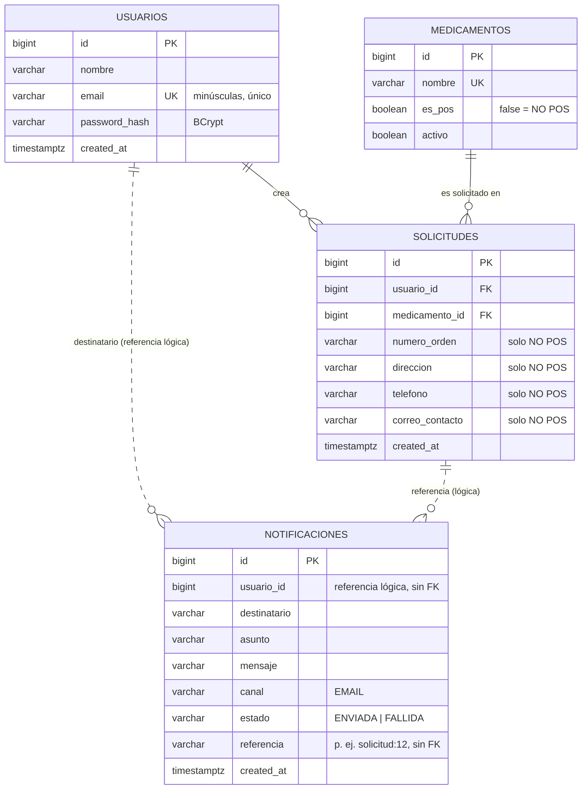

# Modelo Entidad-Relación

Diagrama en Mermaid (texto plano, versionable; se renderiza en GitHub).

## Cardinalidades
- Un **usuario** crea 0..N **solicitudes**; cada solicitud pertenece a un único usuario (1:N).
- Un **medicamento** aparece en 0..N **solicitudes**; cada solicitud referencia exactamente un medicamento (1:N).
- Usuarios y medicamentos no se relacionan directamente: la relación N:M entre ambos se resuelve a través de `solicitudes`.

## Reglas de integridad
| Regla | Dónde se garantiza |
|---|---|
| Email único y en minúsculas | `UNIQUE` + `CHECK` en `usuarios` |
| Password nunca en texto plano | Hash BCrypt en `auth-service` |
| Medicamento NO POS ⇒ 4 campos obligatorios | `SolicitudNoPosValidator` (servicio) + validación del formulario |
| Los 4 campos NO POS son "todos o ninguno" | `CHECK ck_solicitudes_datos_no_pos` |
| Solicitud siempre ligada a usuario y medicamento existentes | Claves foráneas |

## Esquemas
- `auth` → tabla `usuarios` (propiedad de `auth-service`).
- `solicitudes` → tablas `medicamentos` y `solicitudes` (propiedad de `solicitudes-service`).
- `notificaciones` → tabla `notificaciones` (propiedad de `notificaciones-service`). Sus vínculos con usuarios y solicitudes son **lógicos** (sin FK) para que el servicio pueda tener su propia base de datos.

Script completo: [`schema.sql`](schema.sql) · datos de ejemplo: [`seed.sql`](seed.sql).
