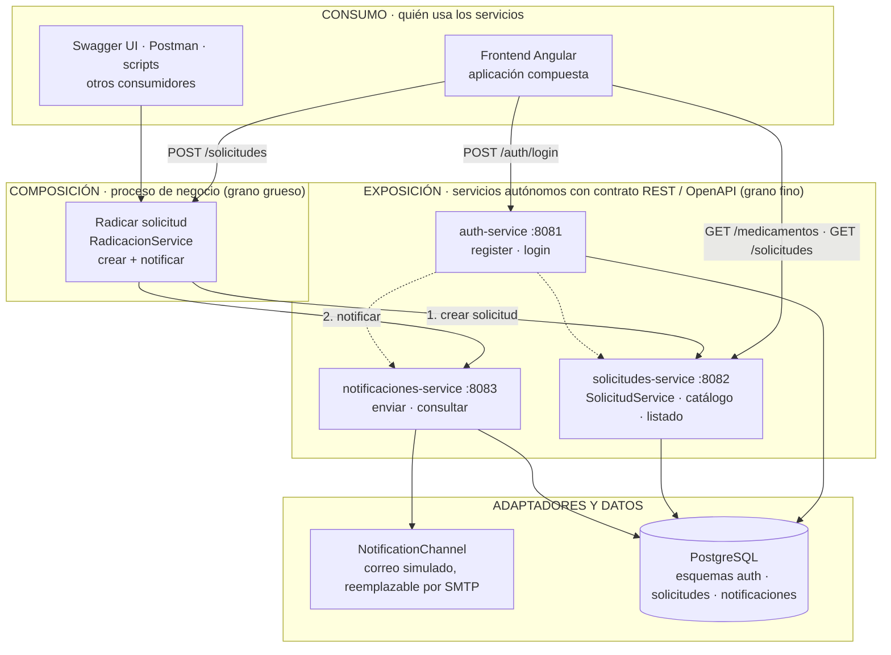
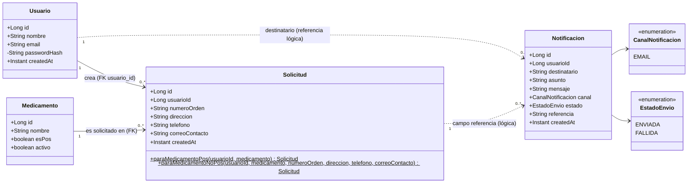
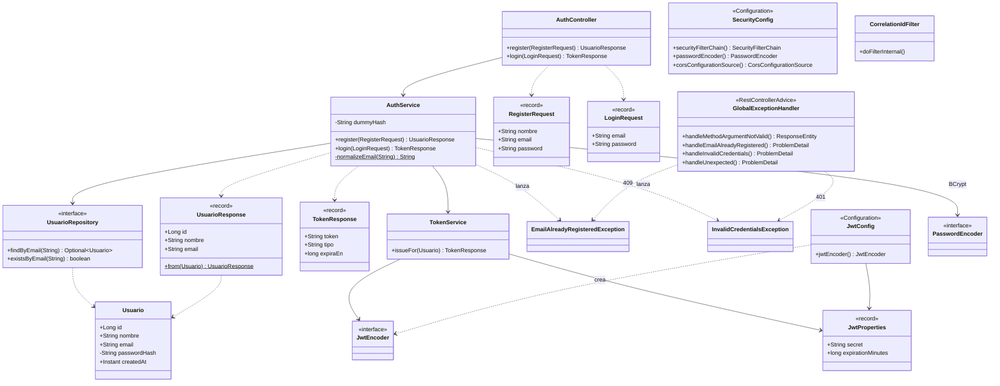
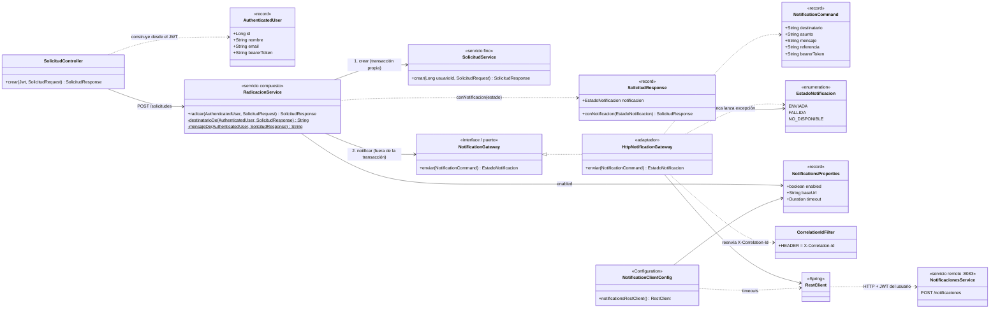
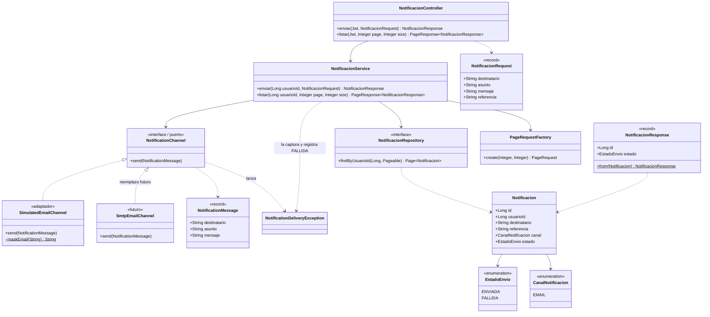
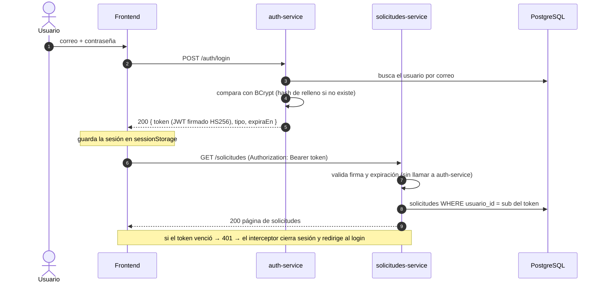
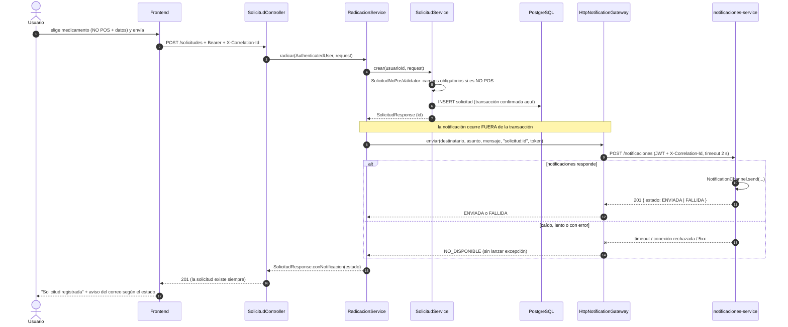

# Diagramas

Todos los diagramas están en Mermaid (texto versionable; GitHub los renderiza). Las imágenes exportadas (SVG y PNG) están en [`docs/img/`](img/).

**Índice**
1. [Vista SOA por capas](#1-vista-soa-por-capas)
2. [Modelo de dominio (entre servicios)](#2-modelo-de-dominio-entre-servicios)
3. [Clases de `auth-service`](#3-clases-de-auth-service)
4. [Clases de `solicitudes-service` — capas y regla NO POS](#4-clases-de-solicitudes-service--capas-y-regla-no-pos)
5. [Clases de `solicitudes-service` — composición "Radicar solicitud"](#5-clases-de-solicitudes-service--composición-radicar-solicitud)
6. [Clases de `notificaciones-service`](#6-clases-de-notificaciones-service)
7. [Clases del frontend Angular](#7-clases-del-frontend-angular)
8. [Secuencia: autenticación y uso del token](#8-secuencia-autenticación-y-uso-del-token)
9. [Secuencia: Radicar solicitud (camino feliz y degradación)](#9-secuencia-radicar-solicitud-camino-feliz-y-degradación)

---

## 1. Vista SOA por capas

Las tres fases de SOA — **exposición, composición y consumo** — aplicadas al proyecto.

> Líneas punteadas: el JWT que firma `auth-service` (secreto compartido) es validado por los otros dos servicios sin llamarlo. La notificación (paso 2) se hace con *timeout* y degradación elegante.
>
> `RadicacionService` vive dentro de `solicitudes-service` (es un servicio compuesto, no un cuarto despliegue): compone el servicio fino `SolicitudService` con el remoto `notificaciones-service`.

---

## 2. Modelo de dominio (entre servicios)

Cada servicio es dueño de sus entidades. Línea continua = clave foránea real; línea punteada = **referencia lógica** (sin FK, para poder separar las bases de datos).

| Servicio | Entidades propias | Esquema |
|---|---|---|
| `auth-service` | `Usuario` | `auth` |
| `solicitudes-service` | `Medicamento`, `Solicitud` | `solicitudes` |
| `notificaciones-service` | `Notificacion` | `notificaciones` |

---

## 3. Clases de `auth-service`

---

## 4. Clases de `solicitudes-service` — capas y regla NO POS

```mermaid
classDiagram
    direction TB

    class SolicitudController {
        +crear(Jwt, SolicitudRequest) SolicitudResponse
        +listar(Jwt, Integer page, Integer size) PageResponse~SolicitudResponse~
    }
    class MedicamentoController {
        +listar() List~MedicamentoResponse~
    }
    class SolicitudService {
        +crear(Long usuarioId, SolicitudRequest) SolicitudResponse
        +listar(Long usuarioId, Integer page, Integer size) PageResponse~SolicitudResponse~
    }
    class MedicamentoService {
        +listarActivos() List~MedicamentoResponse~
    }
    class SolicitudNoPosValidator {
        <<regla de negocio>>
        +validate(Medicamento, SolicitudRequest)
    }
    class PageRequestFactory {
        +create(Integer page, Integer size) PageRequest
    }
    class SolicitudRepository {
        <<interface>>
        +findByUsuarioId(Long, Pageable) Page~Solicitud~
    }
    class MedicamentoRepository {
        <<interface>>
        +findByActivoTrue(Sort) List~Medicamento~
        +findByIdAndActivoTrue(Long) Optional~Medicamento~
    }
    class Solicitud {
        +Long id
        +Long usuarioId
        +Medicamento medicamento
        +String numeroOrden
        +String direccion
        +String telefono
        +String correoContacto
        +paraMedicamentoPos()$ Solicitud
        +paraMedicamentoNoPos()$ Solicitud
    }
    class Medicamento {
        +Long id
        +String nombre
        +boolean esPos
        +boolean activo
    }
    class SolicitudRequest {
        <<record>>
        +Long medicamentoId
        +String numeroOrden
        +String direccion
        +String telefono
        +String correoContacto
    }
    class SolicitudResponse {
        <<record>>
        +Long id
        +MedicamentoResponse medicamento
        +EstadoNotificacion notificacion
        +from(Solicitud)$ SolicitudResponse
        +conNotificacion(EstadoNotificacion) SolicitudResponse
    }
    class MedicamentoResponse {
        <<record>>
        +Long id
        +String nombre
        +boolean esPos
    }
    class PageResponse~T~ {
        <<record>>
        +List~T~ content
        +int page
        +int size
        +long totalElements
        +int totalPages
    }
    class RequestValidationException {
        +Map errors
    }
    class MedicamentoNoDisponibleException
    class GlobalExceptionHandler {
        <<RestControllerAdvice>>
        +handleRequestValidation() ProblemDetail
        +handleMedicamentoNoDisponible() ProblemDetail
        +handleUnexpected() ProblemDetail
    }
    class ProblemDetailSecurityHandlers {
        +commence() 401
        +handle() 403
    }

    MedicamentoController --> MedicamentoService
    SolicitudController --> SolicitudService : listar
    SolicitudService --> SolicitudRepository
    SolicitudService --> MedicamentoRepository
    SolicitudService --> SolicitudNoPosValidator
    SolicitudService --> PageRequestFactory
    MedicamentoService --> MedicamentoRepository
    SolicitudRepository ..> Solicitud
    MedicamentoRepository ..> Medicamento
    Solicitud "0..*" --> "1" Medicamento
    SolicitudNoPosValidator ..> Medicamento
    SolicitudNoPosValidator ..> SolicitudRequest
    SolicitudNoPosValidator ..> RequestValidationException : lanza
    PageRequestFactory ..> RequestValidationException : lanza
    SolicitudService ..> MedicamentoNoDisponibleException : lanza
    SolicitudService ..> SolicitudResponse
    SolicitudResponse --> MedicamentoResponse
    SolicitudService ..> PageResponse
    GlobalExceptionHandler ..> RequestValidationException : 400
    GlobalExceptionHandler ..> MedicamentoNoDisponibleException : 422
```

---

## 5. Clases de `solicitudes-service` — composición "Radicar solicitud"

El servicio compuesto depende de un **puerto** (`NotificationGateway`), no de HTTP. El adaptador `HttpNotificationGateway` traduce cualquier fallo remoto a `NO_DISPONIBLE`, por lo que la solicitud nunca se pierde.

---

## 6. Clases de `notificaciones-service`

`NotificationChannel` es el **adaptador**: permite sustituir el correo simulado por un SMTP real, o añadir SMS, sin tocar el servicio ni el contrato.

---

## 7. Clases del frontend Angular

Estructura `core` (singleton de la aplicación) → `shared` (reutilizable) → `features` (pantallas). Las funciones (`authInterceptor`, guards) se muestran como clases para ilustrar sus dependencias.

```mermaid
classDiagram
    direction TB

    class AuthService {
        +session Signal~Session|null~
        +register(RegisterRequest) Observable~Usuario~
        +login(LoginRequest) Observable~TokenResponse~
        +logout()
        +isAuthenticated() boolean
        +token() string|null
    }
    class authInterceptor {
        <<HttpInterceptorFn>>
        adjunta Bearer solo a solicitudesApiUrl
        ante 401: logout y redirige a login
    }
    class authGuard {
        <<CanActivateFn>>
    }
    class guestGuard {
        <<CanActivateFn>>
    }
    class SolicitudService {
        +create(SolicitudRequest) Observable~Solicitud~
        +list(page, size) Observable~Page~Solicitud~~
    }
    class MedicamentoService {
        +list() Observable~Medicamento[]~
    }
    class LoginComponent {
        -form FormGroup
        +submit()
    }
    class RegisterComponent {
        -form FormGroup
        +submit()
    }
    class SolicitudFormComponent {
        -form FormGroup
        -selected Signal~Medicamento|null~
        -isNoPos Signal~boolean~
        +submit()
        -configureNoPosFields(required)
        -buildRequest() SolicitudRequest
    }
    class SolicitudListComponent {
        -page Signal~number~
        -size Signal~number~
        -data Signal~Page~
        +goToPage(page)
        +changeSize(size)
        +retry()
    }
    class PaginationComponent {
        +page input
        +totalPages input
        +pageChange output
        +sizeChange output
    }
    class FieldErrorComponent {
        +control input
    }
    class AlertComponent {
        +type input
    }
    class HeaderComponent {
        +logout()
    }
    class formValidators {
        <<funciones>>
        notBlank
        emailFormat
        phoneFormat
        passwordStrength
        fieldsMatch
    }
    class toApiError {
        <<función>>
        HttpErrorResponse a ApiError
    }
    class Session {
        <<interface>>
        +token
        +nombre
        +email
        +expiresAt
    }
    class Solicitud {
        <<interface>>
        +id
        +medicamento
        +notificacion EstadoNotificacion
    }

    LoginComponent --> AuthService
    RegisterComponent --> AuthService
    HeaderComponent --> AuthService
    authInterceptor --> AuthService
    authGuard --> AuthService
    guestGuard --> AuthService
    AuthService --> Session
    SolicitudFormComponent --> SolicitudService
    SolicitudFormComponent --> MedicamentoService
    SolicitudListComponent --> SolicitudService
    SolicitudListComponent --> PaginationComponent
    SolicitudFormComponent --> FieldErrorComponent
    LoginComponent --> FieldErrorComponent
    RegisterComponent --> FieldErrorComponent
    SolicitudFormComponent --> AlertComponent
    SolicitudFormComponent ..> formValidators
    RegisterComponent ..> formValidators
    SolicitudFormComponent ..> toApiError
    SolicitudService --> Solicitud
```

---

## 8. Secuencia: autenticación y uso del token

---

## 9. Secuencia: Radicar solicitud (camino feliz y degradación)

